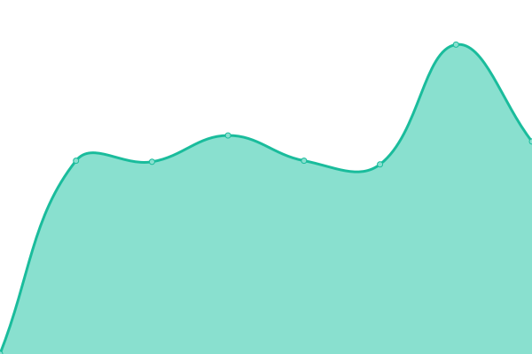

# [📈 Live Status](https://upptime.hfs.day): <!--live status--> **🟥 Complete outage**

This repository contains the open-source uptime monitor and status page for [Haidar](https://upptime.hfs.day), powered by [Upptime](https://github.com/upptime/upptime).

With [Upptime](https://upptime.js.org), you can get your own unlimited and free uptime monitor and status page, powered entirely by a GitHub repository. We use [Issues](https://github.com/haidars/upptime/issues) as incident reports, [Actions](https://github.com/haidars/upptime/actions) as uptime monitors, and [Pages](https://upptime.hfs.day) for the status page.

<!--start: status pages-->
<!-- This summary is generated by Upptime (https://github.com/upptime/upptime) -->
<!-- Do not edit this manually, your changes will be overwritten -->
<!-- prettier-ignore -->
| URL | Status | History | Response Time | Uptime |
| --- | ------ | ------- | ------------- | ------ |
|  [Uptime Kuma](https://status.hfs.day) | 🟥 Down | [uptime-kuma.yml](https://github.com/haidars/upptime/commits/HEAD/history/uptime-kuma.yml) | 

 811ms
     
 | 

<a href="https://upptime.hfs.day/history/uptime-kuma">99.96%</a>
    

|  [Ad Guard Home](https://dns.hfs.day) | 🟥 Down | [ad-guard-home.yml](https://github.com/haidars/upptime/commits/HEAD/history/ad-guard-home.yml) | 

 1456ms
     
 | 

<a href="https://upptime.hfs.day/history/ad-guard-home">99.96%</a>
    

|  [JellyFin](https://media.hfs.day) | 🟥 Down | [jelly-fin.yml](https://github.com/haidars/upptime/commits/HEAD/history/jelly-fin.yml) | 

 1211ms
     
 | 

<a href="https://upptime.hfs.day/history/jelly-fin">99.97%</a>
    

|  [Jellyseerr](https://jellyseerr.hfs.day/) | 🟥 Down | [jellyseerr.yml](https://github.com/haidars/upptime/commits/HEAD/history/jellyseerr.yml) | 

 1017ms
     
 | 

<a href="https://upptime.hfs.day/history/jellyseerr">99.97%</a>
    

|  [NextCloud](https://nextcloud.hfs.day) | 🟥 Down | [next-cloud.yml](https://github.com/haidars/upptime/commits/HEAD/history/next-cloud.yml) | 

 1082ms
     
 | 

<a href="https://upptime.hfs.day/history/next-cloud">99.98%</a>
    

<!--end: status pages-->

[**Visit our status website →**](https://upptime.hfs.day)

## 📄 License

- Powered by: [Upptime](https://github.com/upptime/upptime)
- Code: [MIT](./LICENSE) © [Haidar](https://upptime.hfs.day)
- Data in the `./history` directory: [Open Database License](https://opendatacommons.org/licenses/odbl/1-0/)
